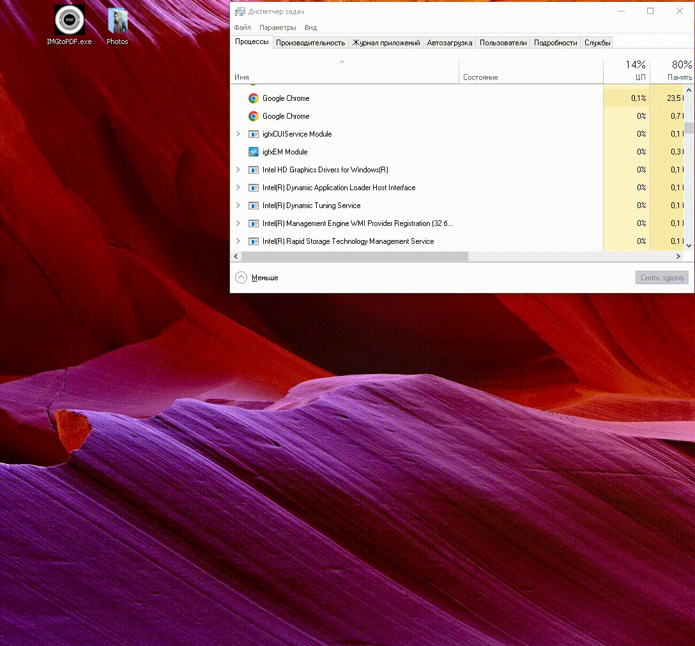

# FastIMGtoPDF

# Image to PDF Converter

This is a simple Python program that converts image files to PDF format using the tkinter and PIL libraries. You can drag and drop image files onto the compiled program shortcut. The program converts the images to PDF and saves them on the desktop.

## Prerequisites

- Python 3.x
- tkinter (typically included with Python)
- PIL (Python Imaging Library)
- tkdnd (Tkinter drag and drop extension)
- pyinstaller (for compiling the script)

## Usage

1. Install the required dependencies:
   `pip install -r requirements.txt`
2. [Install tkdnd](https://youtu.be/JIy0QjwQBl0?t=75).

   Module **tkdnd2.8** must be pasted into **./Python/Python3.^/tcl/tcl8.6/** . In my variant only this way works after compiling.

3. The program will convert the images to PDF format and save them on the desktop.
4. After convertation, program will shutdown automatically.

## Run the program:

- Compile program
- Drag and drop image files onto the compiled "shortcut".exe .
  

## Supported Image Formats

The script supports the following image formats for conversion to PDF:

- .jpg
- .jpeg
- .png
- .gif
- .bmp
- .tiff
- .tif

## Compiling the Script

To compile the script into a standalone executable, you can use PyInstaller. PyInstaller bundles the script and its dependencies into a single executable file.

Run the following command to compile the script:

```bash
pyinstaller --noconfirm --onefile --windowed --icon=media/imgtopdf.ico fastimgtopdf.py
```
